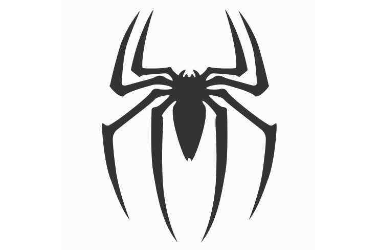

<h1>Tai Spider</h1>

Scrapy Framework implemented by nodejs.

## Movition

Tai Spider is grown from [node-crawler](https://github.com/bda-research/node-crawler), and has similar APIs with [scrapy](https://github.com/scrapy/scrapy). 

## Document

[GitBook](https://edward-zhu.gitbook.io/tai-spider/)

## Examples

You can find some useful examples from [tai-spider-example](https://github.com/wx-rdc/tai-spider-example).